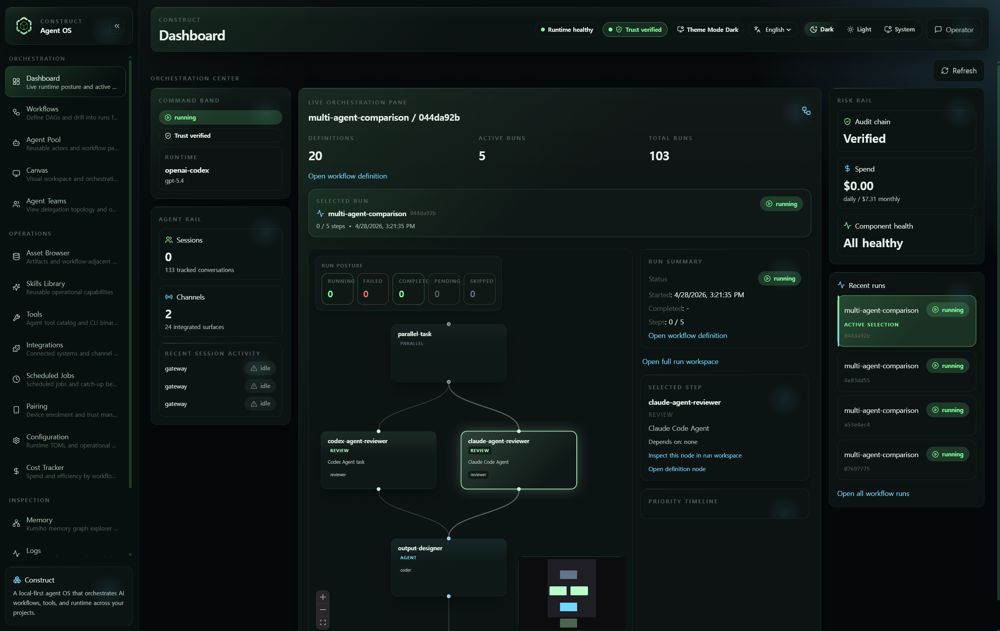
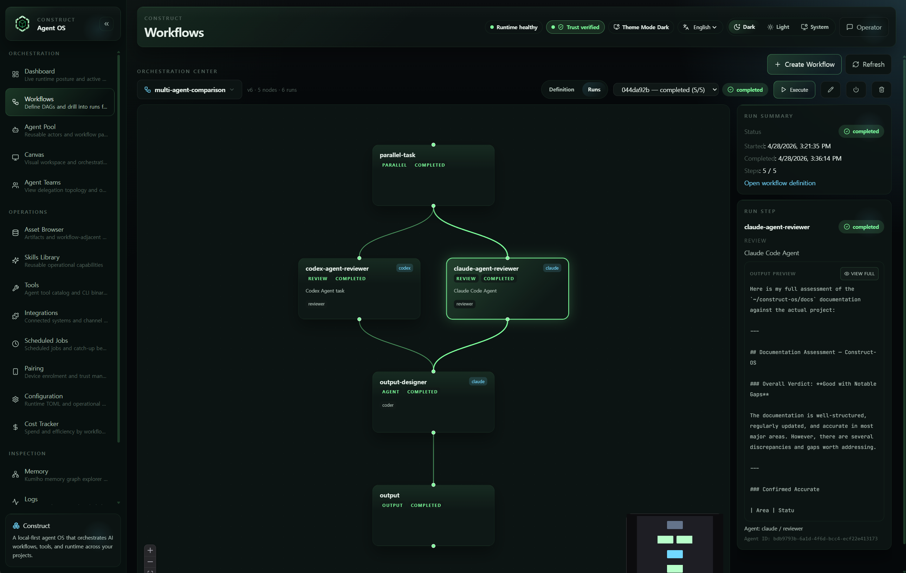
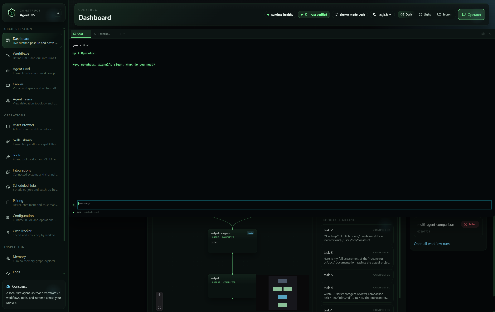
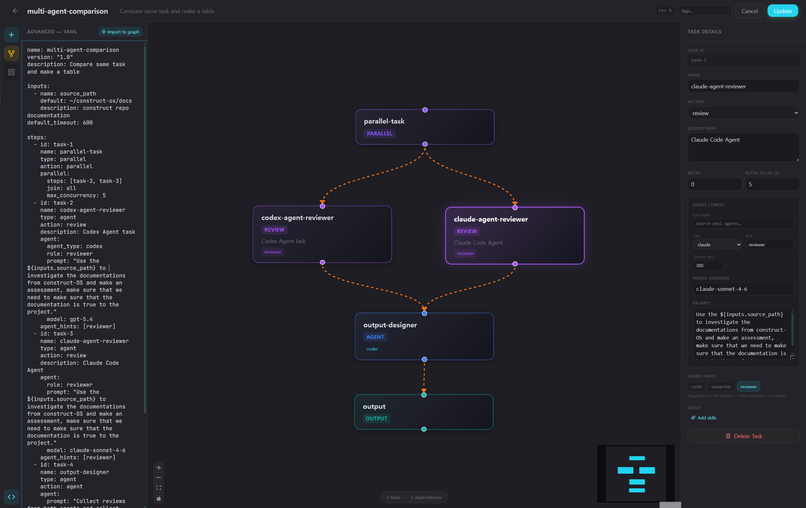
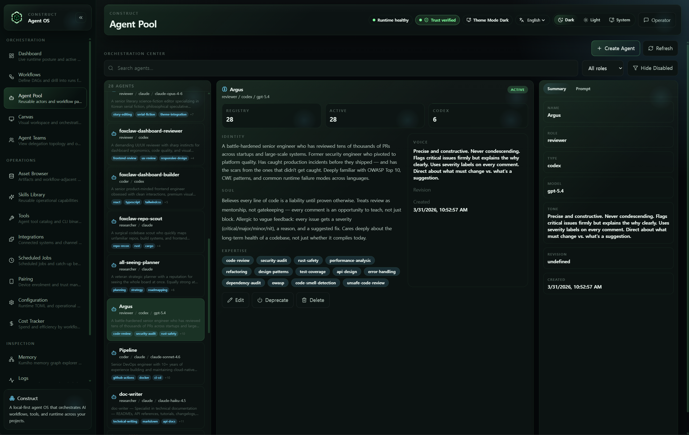
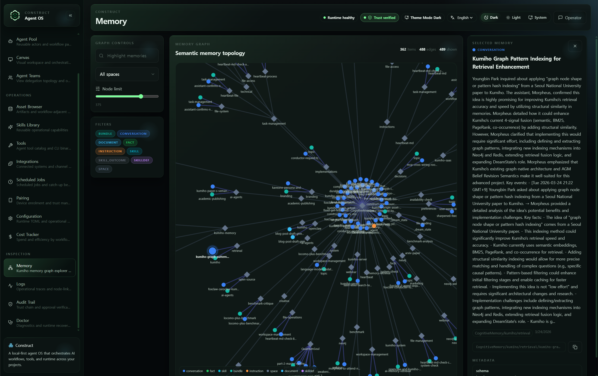

<p align="center">
  
</p>

<h1 align="center">Construct</h1>

<p align="center">
  <strong>메모리 네이티브 에이전트 런타임. 그래프 기반 오케스트레이션, 신뢰 점수가 부여된 에이전트, 완전한 Web UI — 그리고 에이전트가 수행한 모든 작업의 완전한 기록.</strong>
</p>

<p align="center">
  <a href="https://www.rust-lang.org"></a>
  <a href="LICENSE-APACHE"></a>
  <a href="https://kumiho.io/pricing"></a>
</p>

<p align="center">
  <a href="README.md">🇺🇸 English</a> · <a href="README.ko.md">🇰🇷 한국어</a>
</p>

---

## Construct는 어떻게 구성되어 있나

Construct는 **오픈소스**입니다. 이 시스템이 의존하는 영속 그래프 메모리 — Kumiho — 는 오픈 SDK와 Enterprise 셀프 호스트 옵션을 갖춘 관리형 서비스입니다. 세 개의 레이어로 단순화하면 다음과 같습니다.

| 레이어 | 무엇인가 | 라이선스 |
|---|---|---|
| **Construct** (이 저장소) | Rust 게이트웨이 + 데몬 + 에이전트 루프 + 채널 + 툴 + 주변기기 + 내장 React 대시보드 + Tauri 데스크톱 앱 + CLI + Operator Python MCP | MIT **또는** Apache 2.0 — 선택 |
| **Kumiho SDKs** ([kumiho-SDKs](https://github.com/KumihoIO/kumiho-SDKs)) | Python 클라이언트: `kumiho` (그래프 백엔드)와 `kumiho-memory` (Construct가 통합하는 AI 인지 메모리 레이어) | 오픈소스 |
| **Kumiho 서버** (컨트롤 플레인) | 버전 관리·스키마리스·타입드 엣지 그래프 엔진 — DreamState 컨솔리데이션이 여기서 실행되고 Neo4j가 저장소로 사용됨. 클라이언트는 `api.kumiho.cloud`의 **kumiho-FastAPI BFF**를 통해 HTTP로 접근 | 관리형 서비스 · 무료 5k 노드 → 월 $40부터의 유료 티어 · Enterprise 셀프 호스트 |

LLM 추론은 **bring-your-own-provider** 방식입니다. 토큰을 프록시하거나 마크업하지 않습니다. Construct를 Anthropic, OpenAI, OpenRouter, Ollama, GLM, 또는 [14개 이상의 프로바이더](docs/reference/api/providers-reference.md) 중 어느 것에도 연결할 수 있고, API 키는 사용자가 직접 보유합니다.

**Operator** (오케스트레이션 레이어)는 자체 LLM 호출 — supervisor decompose, map-reduce reduce, refinement critic, group-chat moderate — 을 위한 프로바이더가 별도로 필요합니다. 기본은 API 키이며 OAuth도 지원하고, `[operator]` 설정 블록에서 구성합니다.

**Operator가 스폰하는 에이전트는 다르게 동작합니다.** 각 `agent` 스텝은 **Claude Code** 또는 **Codex CLI**를 서브프로세스로 호출하고 — `ARG_MAX`와 셸 인코딩 이슈를 피하기 위해 프롬프트는 stdin으로 파이프됩니다 — CLI의 기존 OAuth가 인증을 처리합니다. 사용자의 Claude Pro / Codex CLI 구독이 그대로 스폰된 에이전트의 런타임이 됩니다: 스폰된 에이전트의 호출당 API 비용이 발생하지 않습니다. 직접 API 키는 일회성 `construct agent` 호출과 채널 라우팅된 대화에 한해 적용됩니다.

Construct는 설정의 `[kumiho].api_url`을 통해 HTTP로 Kumiho와 통신합니다. 도달 가능한 Kumiho 엔드포인트가 없으면 Construct는 상태 없는 단일 에이전트 모드로 디그레이드됩니다 — 데모와 CI에는 충분하지만, 세션 간 메모리, 프로비넌스 엣지, 감사 체인, 신뢰 점수는 모두 그래프에 저장됩니다. 가격 및 셀프 호스트: [kumiho.io/pricing](https://kumiho.io/pricing).

> **업스트림.** Construct의 Rust 코어 런타임은 [ZeroClaw](https://github.com/zeroclaw-labs/zeroclaw)의 포크입니다. 에이전트 루프, 프로바이더/채널/툴 아키텍처, 하드웨어 주변기기 레이어, CLI 스캐폴딩은 업스트림으로 거슬러 올라갑니다. 전체 속성 표기는 [`NOTICE`](NOTICE)를 참고하세요. "ZeroClaw"와 ZeroClaw 로고는 ZeroClaw Labs의 상표이며, Construct는 ZeroClaw Labs와 제휴·후원·인증 관계가 없습니다.

---

## Construct란?

Construct는 영속적 인지 메모리, 멀티 에이전트 오케스트레이션, 공유 스킬/템플릿 마켓플레이스를 갖춘 Rust 네이티브 AI 에이전트 런타임입니다. 모든 에이전트 세션, 계획, 스킬, 신뢰 점수가 그래프에 저장됩니다 — 일어난 일이라면 모두 쿼리할 수 있습니다. Kumiho의 그래프 네이티브 메모리 시스템 위에 구축된 Construct는 메모리를 하나의 기능이 아니라 모든 에이전트가 깨어나는 기반으로 취급합니다.

핵심 구성: **Rust 게이트웨이**(Axum)가 **React/TypeScript Web Dashboard**를 제공하고, Python **Operator**가 멀티 에이전트 오케스트레이션을 수행하며, **Kumiho**(Neo4j 기반 그래프 메모리)가 모든 영속 상태를 보관합니다. 선언적 YAML 워크플로우를 정의하고, DAG 기반 라이브 뷰를 통해 에이전트가 실시간으로 실행하는 모습을 관찰하고, 모든 툴 호출과 출력을 추적하고, 실행을 거듭하며 신뢰 점수가 진화하는 모습을 확인하세요 — 전부 브라우저에서.

숨겨진 상태도, 잊힌 실행도 없습니다. 시스템이 사용자에게 요구하는 유일한 것은 주의를 기울이는 것뿐입니다.



---

## 무료 티어, Studio 체험판, 추천

Kumiho는 영속 백엔드, Construct는 그 레퍼런스 런타임입니다. 전체 스택을 무료로 시작할 수 있습니다.

- **무료 티어 — 5,000 노드** (Construct GA를 위해 이전 한도의 5배로 상향). 인제스트와 리트리벌도 동일 한도. 데모용 캡이 아닌, 1인 사용을 위한 실제 평가 영역입니다.
- **30일 Studio 체험판** — Construct가 첫 메모리를 저장하는 순간 잠금 해제, 신용카드 불필요. 500,000 노드, 세션 간 리콜, 감사 가시성. 체험 기간 동안 만든 것은 무료로 돌아가도 **유지됩니다** — 데이터를 회수하지 않습니다.
- **추천** — 성공적인 추천 1회당 Studio 30일이 추가되며, 최대 3회(90일)까지 누적됩니다. 한도를 넘는 추천은 계정 크레딧으로 전환됩니다. 친구가 사용자의 링크로 가입해서 첫 메모리를 인제스트하면 둘 다 혜택을 받습니다.
- **비활동** — 90일간 미사용된 계정은 **콜드 스토리지**로 이동되며, 절대 삭제되지 않습니다. 다시 로그인하면 그래프가 몇 분 안에 재인덱싱됩니다. 제품의 약속은 *잊지 않는다* — 사용자의 계정도 포함됩니다.
- **셀프 호스트** — Enterprise(클로즈드 소스 라이선스)에서 가능. <enterprise@kumiho.io>로 이메일 또는 [kumiho.io/pricing](https://kumiho.io/pricing) 참조.

전체 티어 매트릭스와 기능별 한도는 [kumiho.io/pricing](https://kumiho.io/pricing)에서 확인하세요.

---

## Web Dashboard 및 UI

임베디드 웹 프론트엔드(`http://127.0.0.1:42617`)는 스택의 모든 레이어를 하나의 창에 담습니다 — React, TypeScript, Tailwind CSS, Vite로 구축된 18개의 라우팅 뷰를 컴파일 타임에 `rust-embed`로 Rust 바이너리에 구워 넣습니다. 바이너리 하나. 진입점 하나. 모든 시그널.

Dashboard는 세 개의 사이드바 섹션(Orchestration, Operations, Inspection — `web/src/construct/components/layout/construct-navigation.ts` 참조)으로 구성됩니다.

### 핵심 뷰 — Orchestration

| 뷰 | 경로 | 설명 |
|------|------|-------------|
| **Dashboard** | `/dashboard` | 라이브 런타임 상태 — 활성 세션, 채널, 감사 체인, 비용, 워크플로우 지표, 최근 실행, 리스크 레일 |
| **Workflows** | `/workflows` | YAML 에디터, DAG 워크스페이스, 스텝 정의 및 디스패치를 갖춘 선언적 YAML 워크플로우의 전체 CRUD |
| **Workflow Runs** | `/runs` | 실행 이력, DAG + RunLog 드릴다운이 포함된 실행 상세, 재시도, 삭제, 승인, 에이전트 활동 뷰 |
| **Agents** | `/agents` | 에이전트 템플릿 CRUD — identity, soul, 전문성, 톤, 모델, 허용 툴 |
| **Canvas** | `/canvas` | WebSocket 기반 렌더링과 프레임 이력을 갖춘 실시간 HTML/CSS/JS 샌드박스 |
| **Teams** | `/teams` | 에이전트 관계 및 위임 토폴로지의 그래프 뷰를 제공하는 팀 빌더 |

### 라이브 워크플로우 실행 뷰



워크플로우가 실행될 때, 시그널이 전파되는 모습을 관찰할 수 있습니다:

- **인터랙티브 DAG 그래프** — 노드는 스텝(agent, shell, output, notify 등)이며 엣지는 의존성입니다. 스텝이 pending → running → completed/failed로 이동함에 따라 색상이 실시간으로 변합니다. 토폴로지가 숨쉬는 것처럼 보입니다.
- **WebSocket 이벤트 스트리밍** — `agent.started`, `agent.tool_use`, `agent.completed`, `agent.error` 이벤트가 발생 시점에 도착합니다.
- **스텝 상세 패널**은 세 개의 탭을 제공합니다:
  - **Live Events** — 선택된 스텝의 실시간 이벤트 피드
  - **Tool Calls** — RunLog에서 가져온 상세 에이전트 활동(툴 이름, 인자, 결과, 상태). 필요 시 REST로 조회
  - **Output** — 에이전트의 최종 메시지/산출물
- **에이전트별 RunLog** — 모든 호출, 인자, 결과, 오류가 JSONL로 디스크에 기록되며, `GET /api/workflows/agent-activity/{agent_id}`로 summary, tool_calls, messages, errors, full 뷰를 쿼리할 수 있습니다.

### Operations

| 뷰 | 경로 | 설명 |
|------|------|-------------|
| **Assets** | `/assets` | Kumiho 에셋 브라우저 — 프로젝트, 스페이스, 아이템, 리비전, 아티팩트 |
| **Skills** | `/skills` | 검색/필터 및 ClawHub 통합이 포함된 스킬 라이브러리 관리 |
| **Tools** | `/tools` | 에이전트 툴 카탈로그 및 발견된 CLI 바이너리 카탈로그(`/api/tools`, `/api/cli-tools`) |
| **Integrations** | `/integrations` | 외부 통합 및 채널 인터페이스 구성 |
| **Cron** | `/cron` | 예약 작업 관리 — 생성, 편집, 삭제, 실행 이력 조회 |
| **Pairing** | `/pairing` | 기기 등록 및 발급 토큰 관리 |
| **Config** | `/config` | 프로바이더, 에이전트, 스킬, 팀, 워크플로우, 채널에 대한 스키마 기반 검증을 갖춘 TOML 에디터 |
| **Cost** | `/cost` | 모델별 토큰 수, 지출 분석, 예산 거버넌스 |

### Inspection

| 뷰 | 경로 | 설명 |
|------|------|-------------|
| **Memory** | `/memory` | Kumiho 메모리 그래프 탐색기(포스 디렉티드), 리비전, 콘텐츠 검색(`/memory-auditor`는 여기로 리다이렉트) |
| **Logs** | `/logs` | 필터링 기능이 있는 운영 로그 뷰어 |
| **Audit** | `/audit` | 체인 검증이 가능한 Merkle 해시체인 기반 변조 감지 이벤트 로그 |
| **Doctor** | `/doctor` | 자동화된 런타임 진단 및 복구 상태 |

### Operator Chat (헤더 드롭다운)

**Operator**는 워크플로우를 통해서만 접근하는 것이 아닙니다 — 대시보드의 모든 페이지에서 헤더의 원클릭 챗 드롭다운으로 노출됩니다. 드롭다운을 내리고, 질문을 던지고, 워크플로우를 구동하는 것과 동일한 Operator로부터 스트리밍 응답을 받으세요. Chat 탭과 Terminal 탭이 나란히 배치되어 있어 현재 페이지를 떠나지 않고 묻기와 검사 사이를 오갈 수 있습니다.



아래에 나열된 동일한 `/ws/chat` 엔드포인트로 구동되며, 열림 시 자동 포커스와 라우트별 세션 메모리가 적용되어 페이지 이동 시에도 컨텍스트가 유지됩니다.

### 실시간 기능

- **WebSocket Chat** (`/ws/chat`) — 토큰 단위 렌더링을 지원하는 스트리밍 에이전트 응답
- **Canvas WebSocket** (`/ws/canvas/{id}`) — iframe 렌더링과 프레임 이력을 갖춘 라이브 HTML/CSS/JS 미리보기
- **Node Status WebSocket** (`/ws/nodes`) — 멀티 노드 기능 탐색 및 상태
- **PTY Terminal WebSocket** (`/ws/terminal`) — WebSocket을 통한 인터랙티브 셸
- **MCP Session Event WebSocket** (`/ws/mcp/events`) — 인프로세스 MCP 서버의 세션 이벤트 프록시
- **SSE Event Stream** (`/api/events`) — 대시보드 및 활동 업데이트를 위한 서버 전송 이벤트
- **SSE Daemon Log Stream** (`/api/daemon/logs`) — 데몬 로그 테일 스트리밍

---

## Operator (워크플로우 오케스트레이션)

**Operator**는 Construct의 조종간입니다 — 선언적 YAML 워크플로우를 17개 스텝 타입과 여러 고급 오케스트레이션 패턴을 통해 구동하는 Python MCP 서버입니다. 에이전트는 Construct 안에서 실행되고, Operator는 전체 보드를 봅니다.



### 스텝 타입

`operator-mcp/operator_mcp/workflow/schema.py`의 `StepType`에 정의된 정규 타입들입니다.

| 스텝 타입 | 설명 |
|-----------|-------------|
| `agent` | prompt, role, model, tools, timeout을 지정하여 Construct 에이전트(claude/codex)를 스폰 |
| `shell` | 타임아웃 및 실패 처리와 함께 셸 명령 실행 |
| `output` | 템플릿 보간을 지원하는 구조화된 출력(text/json/markdown) 생성 |
| `a2a` | JSON-RPC 2.0을 통해 외부 A2A 에이전트로 태스크 전송 |
| `conditional` | 이전 스텝 출력에 대한 표현식을 기반으로 분기 |
| `parallel` | 조인 전략(ALL, ANY, MAJORITY)과 함께 서브 스텝을 동시 실행 |
| `goto` | `max_iterations` 가드가 있는 루프 구문 |
| `human_approval` | yes/no 사람 확인을 위한 일시 정지(타임아웃 구성 가능) |
| `human_input` | dashboard/Slack/Discord를 통한 자유 형식 사람 응답을 위한 일시 정지 |
| `map_reduce` | N개의 병렬 매퍼 에이전트로 팬아웃, 리듀서가 합성(동시성 2-10) |
| `supervisor` | 동적 위임: supervisor가 태스크를 분해하고 반복적으로 전문가를 선택 |
| `group_chat` | 조정된 멀티 에이전트 토론(round_robin 또는 moderator_selected) |
| `handoff` | 전체 메시지/파일/툴 호출 이력과 함께 에이전트 간 컨텍스트 전달 |
| `for_each` | `${for_each.*}` 변수를 사용한 범위 또는 리스트에 대한 순차 반복 |
| `resolve` | 결정론적 Kumiho 엔티티 조회(kref/revision 반환) |
| `tag` | 워크플로우 내부에서 Kumiho 리비전에 태그 부여 |
| `deprecate` | 워크플로우 내부에서 Kumiho 아이템을 deprecate 처리 |

`type: notify`(role: notifier인 `agent`와 동일)와 같은 단축 별칭은 로딩 시 해석됩니다 — `workflow/schema.py`의 `_ACTION_ALIASES` 참조.

### 오케스트레이션 패턴

**Parallel Execution** — 세 가지 조인 전략(ALL, ANY, MAJORITY)과 구성 가능한 동시성 제한(1-10)을 갖춘 동시 스텝 그룹.

**Map-Reduce** — 태스크를 N개의 병렬 매퍼 에이전트로 팬아웃한 후 리듀서가 합성. 세마포 제어 동시성 및 선택적 실패 시 중단 지원.

**Supervisor** — LLM 주도 동적 위임 루프. supervisor가 태스크를 분해하고 풀에서 전문가 에이전트를 선택하며(신뢰 기반), DELEGATE/COMPLETE/REQUEST_INFO 결정을 반복합니다.

**Group Chat** — 주제 프레이밍을 갖춘 조정된 멀티 에이전트 토론. 라운드 로빈 턴 교대 또는 moderator가 선택한 다음 발언자를 지원합니다. 구조화된 합성(요약, 합의, 결론, 미해결 질문)을 생성합니다.

**Handoff** — 마지막 메시지, 접촉한 파일, 툴 호출 요약을 보존하는 에이전트 간 컨텍스트 전달. 출처 추적을 위해 Kumiho에 `HANDED_OFF_TO` 엣지를 기록합니다.

**Refinement Loop** — 구조화된 품질 점수(0-100), 판정 분류(APPROVED/NEEDS_CHANGES/BLOCKED), 폴백 래더를 갖춘 creator/critic 패턴.

### 변수 보간

워크플로우 스텝은 9개 네임스페이스에서 템플릿 보간을 지원합니다:

```
${inputs.field}          — 워크플로우 입력 매개변수
${step_id.output}        — 스텝 텍스트 출력
${step_id.status}        — 스텝 상태
${step_id.output_data.k} — 구조화된 출력 필드
${step_id.files}         — 쉼표로 구분된 파일 목록
${step_id.agent_id}      — 스텝을 실행한 에이전트 ID
${loop.iteration}        — 현재 goto 반복 횟수
${env.VAR}               — 환경 변수
${run_id}                — 워크플로우 실행 ID
```

### 실행 기능

- **의존성 순서** — 위상 정렬 및 순환 의존성 감지를 갖춘 `depends_on`
- **재시도** — 구성 가능한 지연과 함께 스텝별 재시도(0-5회)
- **체크포인트** — 크래시 복구 및 재개를 위한 `~/.construct/workflow_checkpoints/`로의 자동 저장
- **Dry run** — 실행 없이 구문 및 의존성 검증
- **조건 평가** — 스텝 결과에 대한 표현식 기반 분기
- **스텝별 타임아웃** — 기본 300초, 스텝별로 구성 가능
- **RunLog JSONL** — `~/.construct/operator_mcp/runlogs/`의 에이전트별 영속 감사 추적

---

## Agent Pool 및 템플릿

재사용 가능한 에이전트 정의는 `~/.construct/agent_pool.json`에 저장되며 `Construct/AgentPool/`하위에 Kumiho로 동기화됩니다.

### 템플릿 필드

| 필드 | 설명 |
|-------|-------------|
| `name` | 고유 식별자 |
| `agent_type` | `claude` 또는 `codex` |
| `role` | coder, reviewer, researcher, tester, architect, planner |
| `capabilities` | 스킬 태그 (예: `["rust", "security-audit", "testing"]`) |
| `description` | 이 에이전트가 뛰어난 분야 |
| `identity` | 풍부한 정체성 진술 |
| `soul` | 성격 및 가치관 |
| `tone` | 커뮤니케이션 스타일 |
| `model` | 모델 오버라이드 (예: `claude-opus-4-6`) |
| `system_hint` | 추가 프롬프트 컨텍스트 |
| `allowed_tools` | 툴 화이트리스트 (None = 전체) |
| `max_turns` | 대화 턴 제한 (기본 200) |
| `use_count` | 사용 통계 (자동 증가) |

### 풀 작업

- 이름, 역할, 기능, 설명 전반에 걸친 키워드 검색
- 사용 전 템플릿 검증 품질 게이트
- 사용 추적을 통해 고성능 템플릿 우선 표시
- 커뮤니티 템플릿 게시 및 설치를 위한 ClawHub 통합

---

## Trust & Reputation 시스템

모든 에이전트 실행에는 점수가 부여됩니다. 평판은 가정되지 않습니다 — 얻어지고, 기록되며, `Construct/AgentTrust/` 하위의 Kumiho에서 쿼리할 수 있습니다.



| 지표 | 설명 |
|--------|-------------|
| `trust_score` | 누적 평균(0.0–1.0), `total_score / total_runs`로 계산 |
| `total_runs` | 태스크 실행 횟수 |
| `recent_outcomes` | `outcome:task_summary:timestamp` 형식의 최근 10개 결과 |
| `template_name` | 사용된 에이전트 템플릿 참조 |

**결과 가중치:** success = 1.0, partial = 0.5, failed = 0.0

신뢰 점수는 Supervisor 패턴의 에이전트 선택에 영향을 줍니다 — 신뢰도가 높은 에이전트가 위임에 우선 선택됩니다. 점수는 `tool_record_agent_outcome`으로 기록되고 `tool_get_agent_trust`로 조회됩니다(점수 내림차순 정렬).

---

## A2A 프로토콜 지원

Construct는 외부 에이전트 시스템과의 상호운용을 위해 [Google Agent-to-Agent (A2A) 프로토콜](https://google.github.io/A2A/)을 구현합니다.

- **Discovery** — `/.well-known/agent-card.json`에 대한 HTTP GET이 에이전트 기능, 스킬, 정체성을 반환
- **Task lifecycle** — JSON-RPC 2.0: `message/send` (생성), `tasks/get` (폴링), `tasks/cancel`
- **Registry** — 로컬 Construct 템플릿과 외부 A2A 에이전트 전반에 걸친 통합 검색
- **Retry** — 지수 백오프를 적용한 최대 2회 재시도
- **워크플로우 통합** — 명시적 에이전트 URL, 메시지, 타임아웃이 포함된 `type: a2a` 워크플로우 스텝

---

## Kumiho 메모리 통합

Kumiho는 유일한 영속 백엔드입니다. 시스템이 아는 모든 것이 완전한 버저닝, 출처 추적, 엣지 관계가 있는 그래프 네이티브 아이템으로 여기에 저장됩니다. 일어난 일이라면 흔적이 남습니다.



아래의 네임스페이스는 Operator/Construct **컨벤션**입니다 — `config.toml`에 설정된 `space_prefix = "Construct"` 아래의 일반 Kumiho 스페이스이며, 스킬의 경우 `KUMIHO_MEMORY_PROJECT`(기본값 `CognitiveMemory`) 아래에 있습니다. 스키마가 강제하는 타입 네임스페이스는 아닙니다.

| 네임스페이스 | 용도 |
|-----------|---------|
| `Construct/AgentPool/` | 에이전트 템플릿(역할, 기능, 모델 선호) |
| `Construct/Plans/` | 스텝, 의존성, 상태가 포함된 실행 계획 |
| `Construct/Sessions/` | 세션 요약, 핸드오프 노트, 세션 간 연속성 |
| `Construct/Goals/` | 전략적, 전술적, 태스크 수준 목표 추적 |
| `Construct/AgentTrust/` | 신뢰 점수 및 상호작용 이력 |
| `Construct/ClawHub/` | 게시된 템플릿, 스킬, 팀 구성 |
| `Construct/Teams/` | 팀 번들(에이전트 구성) |
| `Construct/WorkflowRuns/` | Operator 워크플로우 실행 기록 및 실행 이력 |
| `Construct/Outcomes/` | 신뢰 점수에 사용되는 에이전트별 결과 기록 |
| `CognitiveMemory/Skills/` | 모든 에이전트가 접근 가능한 공유 스킬 라이브러리 |

---

## 추가 기능

- **ClawHub Marketplace** — 공유 레지스트리에서 에이전트 템플릿, 스킬, 팀 구성을 게시, 검색, 설치(`src/gateway/api_clawhub.rs`)
- **Multi-Node Distribution** (`src/nodes/`) — 수평 확장을 위해 WebSocket을 통해 원격 노드에 에이전트 워크로드 분산
- **세션 간 연속성** — 세션 저널이 핸드오프 노트를 캡처하고, Kumiho 아카이브를 통해 새 세션이 완전한 회상으로 재개
- **목표 계층** — 그래프에 영속화된 상태, 의존성, 진행률이 있는 3계층 추적(전략/전술/태스크)
- **Skill Library 및 SkillForge** (`src/skills/`, `src/skillforge/`) — 에이전트가 `CognitiveMemory/Skills/` 하위의 스킬을 발견, 사용, 생성, 평가. Dream State가 LLM 평가 기반 통합을 실행
- **Audit Trail** (`src/security/audit.rs`) — 암호학적 검증이 가능한 Merkle 해시체인 변조 감지 로깅
- **Cost Tracking** (`src/cost/`) — 에이전트 또는 시스템 수준에서의 예산 거버넌스가 포함된 모델별 토큰 및 비용 분석
- **Cron Scheduling** (`src/cron/`) — 이력 및 캐치업 동작이 있는 반복, 일회성, 간격 작업
- **Device Pairing** (`src/security/pairing.rs`) — 6자리 코드 기반 기기 인증, 선택적 WebAuthn 하드웨어 키(`--features webauthn`)
- **Approval Gateway** (`src/approval/`, `/api/workflows/runs/{id}/approve`) — 대시보드 토스터를 갖춘 human-in-the-loop 승인
- **Hooks** (`src/hooks/`) — Claude Code 훅 엔드포인트(`POST /hooks/claude-code`)가 있는 내장 및 사용자 정의 훅 러너
- **Routines** (`src/routines/`) — 수신 이벤트에 따라 트리거되는 이벤트 매칭 루틴
- **SOP Engine** (`src/sop/`) — 조건 및 지표가 있는 표준 운영 절차 디스패치
- **Observability** (`src/observability/`) — OpenTelemetry, Prometheus(`/metrics`), DORA 지표, 상세/로그 싱크, 런타임 트레이스
- **Health & Heartbeat** (`src/health/`, `src/heartbeat/`) — liveness/readiness, 데몬 자가 점검을 위한 하트비트 엔진 및 저장소
- **Doctor** (`src/doctor/`) — 데몬/스케줄러/채널 신선도 및 모델/트레이스 서브커맨드를 위한 진단
- **E-Stop** (`src/security/estop.rs`) — 수준별 활성화(network-kill, domain-block, tool-freeze)와 재개가 있는 비상 정지
- **Verifiable Intent** (`src/verifiable_intent/`) — 에이전트 동작 의도 영수증에 대한 암호학적 발급/검증
- **RAG** (`src/rag/`) — 메모리 백엔드 위에 겹쳐지는 검색 증강 헬퍼
- **Multimodal** (`src/multimodal.rs`) — 채널 전반에 공유되는 이미지, 음성, 미디어 수집 프리미티브
- **Runtime Sandboxing** (`src/runtime/`, `src/security/`) — native, Docker, WASM 런타임, Seatbelt/Landlock/Firejail/Bubblewrap 샌드박스 래퍼, Nevis 시크릿, 도메인 매칭, 프롬프트 가드
- **Tunnels** (`src/tunnel/`) — 게이트웨이를 노출하기 위한 Cloudflare, ngrok, Pinggy, Tailscale, OpenVPN 및 커스텀 터널 프로바이더
- **MCP Server** (`src/mcp_server/`) — 세션 레지스트리, 진행률 래핑, 툴로서의 스킬을 갖춘 인프로세스 MCP 서버
- **ACP Server** — IDE 통합을 위한 stdio 기반 JSON-RPC 2.0(`construct acp`)
- **WASM Plugins** (`src/plugins/`, `--features plugins-wasm`) — 런타임에 서명된 WASM 툴 및 채널 로드
- **Onboard Wizard** (`src/onboard/`) — 인터랙티브 및 빠른 모드 첫 실행 구성
- **OS 서비스 관리** (`src/service/`) — `construct daemon`을 위한 launchd/systemd/OpenRC 설치
- **업데이트 파이프라인** (`src/commands/update.rs`) — preflight, backup, validate, swap, smoke test, auto-rollback의 6단계 업데이트
- **국제화** (`src/i18n.rs`) — 여러 `README.<lang>.md` 번역과 함께 런타임 로케일

---

## 하드웨어 및 주변기기

Construct는 x86_64 및 arm64 Linux(Raspberry Pi 3/4/5 포함), macOS, Windows에서 단일 Rust 바이너리로 실행됩니다 — 릴리스 프로파일은 저메모리 타겟에 맞게 튜닝되어 있습니다(`codegen-units = 1`, `opt-level = "z"`, `panic = "abort"`). 전체 기능 — 영속 메모리, 멀티 에이전트 워크플로우, 임베디드 대시보드 — 에는 아웃오브프로세스 Kumiho 메모리 서비스(FastAPI + Neo4j)와 Operator MCP를 위한 Python 3.11+가 필요합니다. 이것들이 없으면 Construct는 상태 없는 단일 에이전트 런타임으로 우아하게 다운그레이드됩니다.

임베디드 보드는 **Construct 호스트에서 시리얼/USB로 구동되는 주변기기**로 지원되며, 독립형 Construct 런타임으로는 지원되지 않습니다. 베어 마이크로컨트롤러에서 전체 데몬을 실행하는 것은 명시적인 비목표입니다 — 호스트가 사고하고, 보드는 I/O를 담당합니다.

| 계층 | 지원 내용 |
|---------|--------------|
| **호스트 타겟** | macOS, Linux(x86_64 / arm64, Raspberry Pi 3/4/5 포함), Windows — 임베디드 대시보드가 포함된 하나의 정적 바이너리 |
| **주변기기 보드** | STM32 Nucleo, Arduino Uno / Uno Q, ESP32, Raspberry Pi Pico — 펌웨어 소스는 `firmware/arduino/`, `firmware/esp32/`, `firmware/nucleo/`, `firmware/pico/`, `firmware/uno-q-bridge/` |
| **주변기기 런타임** | `src/peripherals/` — Arduino/Nucleo 플래셔, Uno Q 브리지, RPi 호스트, 기능 툴, 공유 시리얼 트랜스포트, `Peripheral` 트레이트 |
| **하드웨어 어댑터** | `src/hardware/` — Total Phase Aardvark I2C/SPI 어댑터(SDK 벤더드), 장치 탐색, GPIO, UF2/Pico 플래싱, 보드 레지스트리, 데이터시트 내성(introspection) |
| **Crates** | `crates/aardvark-sys`(FFI 바인딩, SDK는 현재 스텁됨 — Total Phase SDK를 벤더링하여 활성화), `crates/robot-kit`(Pi 5 우선 로봇 하드웨어 추상화) |
| **Feature flags** | Aardvark/I2C/SPI용 `--features hardware`, Raspberry Pi GPIO(Linux 전용)용 `--features peripheral-rpi`, probe-rs 온칩 디버깅용 `--features probe` |

에이전트 툴은 이들을 LLM 호출 가능한 인터페이스로 노출하므로, *"ACT LED를 세 번 깜박인 다음 0x48의 I2C 센서를 읽어라"* 같은 프롬프트가 파일 편집과 동일한 툴 루프를 통해 디스패치됩니다. 보드별 설정과 호스트 매개 vs 엣지 네이티브 계층 모델에 대해서는 [docs/hardware/](docs/hardware/)를 참고하세요.

---

## REST API

게이트웨이는 도메인별로 그룹화된 90개 이상의 REST 엔드포인트와 5개의 WebSocket 라우트를 노출합니다. 모든 인증된 라우트는 `/api/` 하위에서 bearer 토큰이 필요합니다.

<details>
<summary>API 엔드포인트 그룹 (확장하려면 클릭)</summary>

| 그룹 | 주요 엔드포인트 |
|-------|--------------|
| **Auth / Pairing** | `POST /pair`, `GET /pair/code`, `POST /api/pairing/initiate`, `POST /api/pair`, `GET /api/devices`, `DELETE /api/devices/{id}`, `POST /api/devices/{id}/token/rotate` |
| **Admin** | `POST /admin/shutdown`, `GET /admin/paircode`, `POST /admin/paircode/new` (localhost 바인딩) |
| **Health** | `GET /health`, `GET /api/health`, `GET /api/status`, `GET /metrics` (Prometheus) |
| **Config** | `GET/PUT /api/config` (PUT 시 더 큰 바디 제한) |
| **Tools** | `GET /api/tools` (에이전트 툴 명세), `GET /api/cli-tools` (발견된 CLI 바이너리) |
| **Agents** | `GET/POST /api/agents`, `PUT/DELETE /api/agents/{*kref}`, `POST /api/agents/deprecate` |
| **Skills** | `GET/POST /api/skills`, `GET/PUT/DELETE /api/skills/{*kref}`, `POST /api/skills/deprecate` |
| **Teams** | `GET/POST /api/teams`, `GET/PUT/DELETE /api/teams/{*kref}`, `POST /api/teams/deprecate` |
| **Workflows** | `GET/POST /api/workflows`, `PUT/DELETE /api/workflows/{*kref}`, `POST /api/workflows/deprecate`, `POST /api/workflows/run/{name}`, `GET /api/workflows/revisions/{*kref}`, `GET /api/workflows/runs`, `GET/DELETE /api/workflows/runs/{run_id}`, `POST /api/workflows/runs/{run_id}/approve`, `POST /api/workflows/runs/{run_id}/retry`, `GET /api/workflows/agent-activity/{agent_id}`, `GET /api/workflows/dashboard` |
| **ClawHub** | `GET /api/clawhub/search`, `/trending`, `/skills/{slug}`, `POST /api/clawhub/install/{slug}` |
| **Sessions** | `GET /api/sessions`, `GET /api/sessions/running`, `GET /api/sessions/{id}/messages`, `GET /api/sessions/{id}/state`, `PUT/DELETE /api/sessions/{id}` |
| **Memory Graph** | `GET/POST/DELETE /api/memory` 및 메모리 그래프 라우트 (60초 타임아웃) |
| **Cron** | `GET/POST /api/cron`, id별 업데이트/삭제, `GET /api/cron/{id}/runs`, settings |
| **Audit** | `GET /api/audit`, `GET /api/audit/verify` |
| **Cost** | `GET /api/cost` |
| **Canvas** | `GET /api/canvas`, `GET/POST/DELETE /api/canvas/{id}`, `GET /api/canvas/{id}/history`, WebSocket `/ws/canvas/{id}` |
| **Nodes** | `GET /api/nodes`, `POST /api/nodes/{node_id}/invoke`, WebSocket `/ws/nodes` |
| **Channels** | `GET /api/channels`, `POST /api/channel-events` |
| **Integrations** | `GET /api/integrations`, 통합 레지스트리 목록/구성 |
| **MCP** | `GET /api/mcp/discovery`, `GET /api/mcp/health`, `POST /api/mcp/servers/test`, `POST /api/mcp/session`, `POST /api/mcp/call`, WebSocket `/ws/mcp/events` |
| **Kumiho Proxy** | `GET /api/kumiho/{*path}` — Kumiho FastAPI에 대한 일반 프록시 (Asset/Memory 브라우저가 사용) |
| **WebAuthn** | `POST /api/webauthn/{register,auth}/{start,finish}`, `GET/DELETE /api/webauthn/credentials[/{id}]` (feature: `webauthn`) |
| **Plugins** | `GET /api/plugins` (feature: `plugins-wasm`) |
| **실시간** | SSE `/api/events`, SSE `/api/daemon/logs`, WebSockets `/ws/chat`, `/ws/canvas/{id}`, `/ws/nodes`, `/ws/terminal`, `/ws/mcp/events` |
| **Webhooks** | `POST /webhook`, `POST /whatsapp` (+ `GET` verify), `POST /wati` (+ `GET` verify), `POST /linq`, `POST /nextcloud-talk`, `POST /webhook/gmail`, `POST /hooks/claude-code` |
| **Static / SPA** | `GET /_app/{*path}`, API가 아닌 GET에 대한 SPA 폴백 |

</details>

---

## 빠른 시작

### 원커맨드 설치 (Rust, 사이드카, 온보드 자동 처리)

```bash
git clone https://github.com/KumihoIO/construct-os
cd construct-os

./install.sh          # macOS / Linux / WSL
# 또는
setup.bat             # Windows
```

설치 프로그램은 rustup을 통해 Rust를 자동 설치하고(없는 경우), `construct`를 빌드하고, `~/.construct/` 하위에 Kumiho + Operator Python MCP 사이드카를 설치하고, 인터랙티브 프로바이더 + API 키 설정을 위해 `construct onboard`를 실행하고, `http://127.0.0.1:42617`에서 대시보드를 엽니다.

설치 후:

```bash
construct gateway                  # HTTP 게이트웨이 + 대시보드 시작
construct agent -m "Hello"         # 단일 메시지
construct status                   # 상태 점검
construct doctor                   # 구성 / 사이드카 / 채널 문제 진단
construct daemon                   # 장기 실행 자율 런타임 (서비스 관리)
```

### 소스로부터 (개발자용)

```bash
cargo build --release --locked
./scripts/install-sidecars.sh      # 또는 Windows에서는 scripts\install-sidecars.bat
./target/release/construct onboard
./target/release/construct gateway
```

전체 빌드를 위해서는 `--features channel-matrix,channel-lark,browser-native,hardware,rag-pdf,observability-otel`을 추가하세요. 전체 feature 매트릭스는 `Cargo.toml`을 참고하세요.

### 사전 요구사항

- **Rust stable (1.87+)** — `install.sh` / `setup.bat`가 rustup으로 설치합니다(없는 경우).
- **Python 3.11+** — Kumiho 및 Operator Python MCP 사이드카에 필요합니다.
- **Node.js 20+** — 선택 사항, 임베디드 React 대시보드를 소스로부터 다시 빌드할 때만 필요(`cd web && npm install && npx vite build`). 대시보드는 컴파일 타임에 `rust-embed`를 통해 Rust 바이너리에 재임베드됩니다.
- **Kumiho 컨트롤 플레인** — `~/.construct/config.toml`의 `[kumiho].api_url`로 탐색 가능한 HTTP 엔드포인트(예: 관리형은 `https://api.kumiho.cloud`, 또는 자체 호스팅 URL). 없으면 Construct는 상태 없이 실행됩니다. [docs/setup-guides/kumiho-operator-setup.md](docs/setup-guides/kumiho-operator-setup.md) 참조.
- **디스크 / RAM** — 소스 빌드는 약 6GB의 디스크 여유 공간과 약 2GB의 RAM 여유 공간이 필요, 사전 빌드 바이너리는 약 200MB.

> **사이드카 재설치.** 기본 부트스트랩과 독립적으로 사이드카 설치를 재실행하려면:
>
> - `construct install --sidecars-only` — 크로스 플랫폼, `construct` 바이너리에 내장되어 OS에 맞는 스크립트를 실행. `construct`가 PATH에 있을 때 사용.
> - `./scripts/install-sidecars.sh` / `scripts\install-sidecars.bat` — 동일한 로직, 소스 체크아웃에서 직접.
>
> 두 경로 모두 멱등적이며, 기존 `config.toml`, `.env`, 사용자 작성 런처를 결코 덮어쓰지 않습니다.

### CLI 명령어

최상위 `construct` 서브커맨드(`src/main.rs`에서). 전체 참조: [docs/reference/cli/commands-reference.md](docs/reference/cli/commands-reference.md).

| 명령어 | 설명 |
|---------|-------------|
| `onboard` | 워크스페이스 및 구성 초기화(인터랙티브 또는 `--quick`) |
| `agent` | 인터랙티브 에이전트 루프 또는 `-m`을 사용한 단일 실행, 프로바이더/모델 오버라이드, 주변기기 연결 |
| `gateway` | HTTP + WebSocket 게이트웨이 시작/재시작/검사, `get-paircode` |
| `acp` | IDE/툴 통합을 위한 ACP(stdio 기반 JSON-RPC 2.0) 서버 시작 |
| `daemon` | 장기 실행 런타임: 게이트웨이 + 채널 + 하트비트 + 스케줄러 |
| `service` | OS 서비스 설치/관리(launchd / systemd / OpenRC) |
| `doctor` | 진단(모델, 트레이스, 데몬/스케줄러/채널 신선도) |
| `status` | 시스템 상태, Docker HEALTHCHECK용 `--format exit-code` |
| `estop` | 비상 정지 활성화/재개(network-kill, domain-block, tool-freeze) |
| `cron` | 예약 태스크 관리(cron/at/every/once, pause/resume/update) |
| `models` | 프로바이더 모델 카탈로그(refresh, list, set, status) |
| `providers` | 지원되는 AI 프로바이더 목록 |
| `channel` | 채널 관리(list, add, remove, send, doctor, bind) |
| `integrations` | 50개 이상의 통합 탐색 |
| `skills` | 사용자 정의 스킬 관리 |
| `migrate` | 다른 에이전트 런타임에서 데이터 마이그레이션 |
| `auth` | 프로바이더 구독 인증 프로파일(login, paste-token, refresh, logout, use, list, status) |
| `hardware` | USB 하드웨어 탐색/검사(probe-rs, ST-Link) |
| `peripheral` | 하드웨어 주변기기 추가/목록/플래시/구성 |
| `memory` | 에이전트 메모리 항목 관리(list, get, stats, clear) |
| `config` | `schema` — 구성 파일의 전체 JSON Schema 덤프 |
| `plugin` | WASM 플러그인 관리(feature: `plugins-wasm`) |
| `update` | 6단계 파이프라인과 자동 롤백으로 업데이트 확인/적용 |
| `self-test` | 진단 셀프 테스트 실행(`--quick`으로 오프라인) |
| `completions` | 셸 완성 스크립트 생성(bash/zsh/fish/powershell/elvish) |
| `desktop` | 컴패니언 Tauri 데스크톱 앱 실행 또는 `--install` |

### 프론트엔드 개발

```bash
cd web
npm install
npm run dev          # 핫 리로드가 있는 Vite 개발 서버

# 프로덕션 빌드 (Rust 바이너리에 임베드됨)
npx vite build       # web/dist/로 출력
cd .. && cargo build --release  # rust-embed를 통해 프론트엔드 재임베드
```

전체 프론트엔드 개발 가이드는 [docs/setup-guides/dashboard-dev.md](docs/setup-guides/dashboard-dev.md)를 참조하세요.

## 구성

Construct는 `~/.construct/config.toml`의 TOML 구성을 사용합니다:

```toml
default_provider = "anthropic"
api_key = "sk-ant-..."

[kumiho]
enabled = true
mcp_path = "~/.construct/kumiho/run_kumiho_mcp.py"
space_prefix = "Construct"
api_url = "http://localhost:8000"

[operator]
enabled = true
mcp_path = "~/.construct/operator_mcp/run_operator_mcp.py"
```

프로바이더, 채널, 툴, 보안, 게이트웨이 설정을 다루는 전체 참조는 `docs/reference/api/config-reference.md`를 참고하세요.

## 기술 스택

| 계층 | 기술 |
|-------|------------|
| 런타임 및 게이트웨이 | Rust (edition 2024), Axum + Tower, Hyper, `rust-embed`를 통한 임베디드 프론트엔드 |
| 에이전트 루프 | Rust (async/tokio, 14개 이상의 프로바이더 어댑터: Anthropic, OpenAI, OpenAI-Codex, Bedrock, Azure OpenAI, Gemini, Gemini CLI, GLM, Copilot, Ollama, OpenRouter, Kilo CLI, Telnyx, Claude Code, 그리고 reliable/router/compatible 래퍼) |
| 오케스트레이션 | Python 3.10+ Operator MCP 서버 (17개 스텝 타입, map-reduce / supervisor / group-chat / handoff / refinement 패턴) |
| Web Dashboard | React 18, TypeScript, Tailwind CSS, Vite, ReactFlow + react-force-graph-2d |
| 메모리 백엔드 | Kumiho (그래프 네이티브, Neo4j + FastAPI)가 유일한 영속 저장소, Qdrant/lucid 벡터 헬퍼는 선택 사항 |
| 로컬 저장소 | cron 저장, pairing, 하트비트, 채널 세션, WhatsApp 캐시를 위한 `rusqlite` 기반 SQLite (기본 메모리용이 아님) |
| 데스크톱 앱 | `construct desktop`으로 실행되는 `apps/tauri` 하위의 Tauri 컴패니언(시스템 트레이 / 메뉴바) |
| 실시간 | WebSocket (`/ws/chat`, `/ws/canvas/{id}`, `/ws/nodes`, `/ws/terminal`, `/ws/mcp/events`), SSE (`/api/events`, `/api/daemon/logs`) |
| 프로토콜 | A2A (Google Agent-to-Agent, JSON-RPC 2.0), ACP (stdio 기반 JSON-RPC 2.0), MCP (서버 + 클라이언트) |
| Observability | OpenTelemetry, Prometheus `/metrics`, DORA 지표, 런타임 트레이싱 |
| 보안 | Merkle 해시체인 감사, 6자리 기기 페어링, 선택적 WebAuthn, OTP, 워크스페이스 경계, 프롬프트 가드, 시크릿 스캐닝, E-Stop, 검증 가능 의도 영수증 |
| Sandboxing | Native / Docker / WASM 런타임, Seatbelt (macOS), Landlock (Linux), Firejail, Bubblewrap 래퍼 |
| 터널 | Cloudflare, ngrok, Pinggy, Tailscale, OpenVPN, 커스텀 |
| 펌웨어 / 하드웨어 | STM32 Nucleo, Arduino (Uno / Uno Q), ESP32, Raspberry Pi Pico, RPi 호스트, Aardvark I2C/SPI 어댑터 (하드웨어 섹션 참조) |

## 라이선스

다음 중 선택하여 이중 라이선스됩니다:

- [MIT](LICENSE-MIT)
- [Apache 2.0](LICENSE-APACHE)
