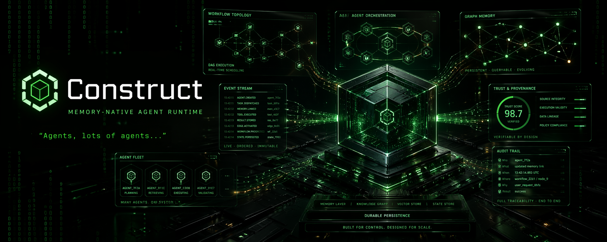

<p align="center">
  
</p>

<h1 align="center">Construct</h1>

<p align="center">
  <strong>A memory-native agent runtime. Graph-backed orchestration, trust-scored agents, a full Web UI — and a complete record of everything your agents have ever done.</strong>
</p>

<p align="center">
  <a href="https://www.rust-lang.org"></a>
  <a href="LICENSE-APACHE"></a>
  <a href="https://kumiho.io/pricing"></a>
</p>

---

## How Construct fits together

Construct is **open source**. The persistent graph memory it depends on — Kumiho — is a managed service with open SDKs and an Enterprise self-host option. Three layers, plain language:

| Layer | What it is | License |
|---|---|---|
| **Construct** (this repo) | Rust gateway + daemon + agent loop + channels + tools + peripherals + embedded React dashboard + Tauri desktop app + CLI + Operator Python MCP | MIT **or** Apache 2.0 — your choice |
| **Kumiho SDKs** ([kumiho-SDKs](https://github.com/KumihoIO/kumiho-SDKs)) | Python clients: `kumiho` (the graph backend) and `kumiho-memory` (the AI cognitive memory layer Construct integrates with) | Open source |
| **Kumiho server** (control plane) | The version-controlled, schemaless, typed-edge graph engine — DreamState consolidation runs here, Neo4j is its store. Reached by clients over HTTP through the **kumiho-FastAPI BFF** at `api.kumiho.cloud`. | Managed service · Free 5k nodes → paid tiers from $40/mo · Self-host on Enterprise |

LLM inference is **bring-your-own-provider**. We don't proxy or mark up tokens. You point Construct at Anthropic, OpenAI, OpenRouter, Ollama, GLM, or any of [14+ providers](docs/reference/api/providers-reference.md), and your keys stay yours.

**Operator and workflow agents execute via CLI subprocess, not API keys.** When the Operator spawns a `claude` or `codex` agent step (and any workflow-driven agent), it shells out to the **Claude Code** or **Codex CLI** as a subprocess — prompt piped over stdin to avoid `ARG_MAX` and shell-encoding issues — and inherits the CLI's **OAuth token**. Your existing Claude Pro / Codex CLI subscription becomes the agent's runtime: no per-call API spend for Operator-driven multi-agent workflows. Direct API-key providers still apply to one-shot `construct agent` calls and channel-routed conversations.

Construct talks to Kumiho over HTTP via `[kumiho].api_url` in your config. Without a reachable Kumiho endpoint, Construct degrades to stateless single-agent operation — useful for demos and CI, but the cross-session memory, provenance edges, audit chain, and trust scoring all live in the graph. Pricing and self-host: [kumiho.io/pricing](https://kumiho.io/pricing).

> **Upstream.** Construct's core Rust runtime is a fork of [ZeroClaw](https://github.com/zeroclaw-labs/zeroclaw). The agent loop, provider/channel/tool architecture, hardware peripheral layer, and CLI scaffolding trace back to that upstream; full attribution in [`NOTICE`](NOTICE) and the consolidated overview at [`docs/upstream/zeroclaw-attribution.md`](docs/upstream/zeroclaw-attribution.md). "ZeroClaw" and the ZeroClaw logo are trademarks of ZeroClaw Labs; Construct is not affiliated with, endorsed by, or sponsored by ZeroClaw Labs.

---

## What is Construct?

Construct is a Rust-native AI agent runtime with persistent cognitive memory, multi-agent orchestration, and a shared skill/template marketplace. Every agent session, plan, skill, and trust score lives in a graph — if it happened, it's queryable. Built on Kumiho's graph-native memory system, Construct treats memory not as a feature but as the substrate every agent wakes up in.

At the core: a **Rust gateway** (Axum) serves a **React/TypeScript Web Dashboard**, a Python **Operator** drives multi-agent orchestration, and **Kumiho** (graph-native, Neo4j-backed) holds all persistent state. Define declarative YAML workflows, watch agents execute them in real time via a DAG-based live view, trace every tool call and output, and see trust scores evolve across runs — all from a browser.

No hidden state. No forgotten runs. The only thing the system asks of you is that you notice.

---

## Free tier, Studio trial, and referrals

Kumiho is the persistent backend; Construct is its reference runtime. Trying the whole stack costs nothing to start.

- **Free tier — 5,000 nodes** (5× the previous limit, bumped for Construct GA). Matching ingest and retrieval limits. Real evaluation territory for solo use, not a demo cap.
- **30-day Studio trial** — unlocks the moment Construct stores its first memory, no credit card. 500,000 nodes, cross-session recall, audit visibility. Whatever you build during the trial, you **keep** when you revert to free; we don't claw back data.
- **Referrals** — each successful referral earns you another 30 days of Studio, stackable up to 3 (90 days). Beyond the cap, additional referrals convert to account credit. Friend signs up via your link and ingests their first memory; you both win.
- **Inactivity** — accounts unused for 90 days move to **cold storage**, never deleted. Log back in and the graph re-indexes within minutes. The product promise is *we don't forget*; that includes your account.
- **Self-host** — available on Enterprise (closed-source license). Email <enterprise@kumiho.io> or see [kumiho.io/pricing](https://kumiho.io/pricing).

Full tier matrix and per-feature limits at [kumiho.io/pricing](https://kumiho.io/pricing).

---

## Web Dashboard & UI

The embedded web frontend (`http://127.0.0.1:42617`) is a single pane over every layer of the stack — 18 routed views built with React, TypeScript, Tailwind CSS, and Vite, then baked into the Rust binary at compile time via `rust-embed`. One binary. One entry point. The whole signal.

The dashboard is organized into three sidebar sections (Orchestration, Operations, Inspection — see `web/src/construct/components/layout/construct-navigation.ts`).

### Core Views — Orchestration

| View | Path | Description |
|------|------|-------------|
| **Dashboard** | `/dashboard` | Live runtime posture — active sessions, channels, audit chain, cost, workflow metrics, recent runs, risk rail |
| **Workflows** | `/workflows` | Full CRUD for declarative YAML workflows with YAML editor, DAG workspace, step definition, and dispatch |
| **Workflow Runs** | `/runs` | Run history, run detail with DAG + RunLog drill-down, retry, delete, approve, and agent activity view |
| **Agents** | `/agents` | CRUD for agent templates — identity, soul, expertise, tone, model, allowed tools |
| **Canvas** | `/canvas` | Real-time HTML/CSS/JS sandbox with WebSocket-driven rendering and frame history |
| **Teams** | `/teams` | Team builder with graph view of agent relationships and delegation topology |

### Live Workflow Execution View

When a workflow runs, you watch the signal propagate:

- **Interactive DAG graph** — nodes are steps (agent, shell, output, notify, etc.), edges are dependencies. Colors shift in real time as steps move through pending → running → completed/failed. The topology breathes.
- **WebSocket event streaming** — `agent.started`, `agent.tool_use`, `agent.completed`, `agent.error` events arrive as they happen.
- **Step detail panel** with three tabs:
  - **Live Events** — real-time event feed for the selected step
  - **Tool Calls** — detailed agent activity from RunLog (tool name, arguments, results, status) fetched via REST on demand
  - **Output** — the agent's final message/deliverable
- **Per-agent RunLog** — every call, argument, result, and error committed to disk as JSONL and queryable via `GET /api/workflows/agent-activity/{agent_id}` with views: summary, tool_calls, messages, errors, full.

### Operations

| View | Path | Description |
|------|------|-------------|
| **Assets** | `/assets` | Kumiho asset browser — projects, spaces, items, revisions, artifacts |
| **Skills** | `/skills` | Skill library management with search/filter and ClawHub integration |
| **Tools** | `/tools` | Agent tool catalog and discovered CLI-binary catalog (`/api/tools`, `/api/cli-tools`) |
| **Integrations** | `/integrations` | External integrations and channel surface configuration |
| **Cron** | `/cron` | Scheduled job management — create, edit, delete, view run history |
| **Pairing** | `/pairing` | Device enrolment and issued-token management |
| **Config** | `/config` | TOML editor with schema-backed validation for providers, agents, skills, teams, workflows, channels |
| **Cost** | `/cost` | Per-model token counts, spend breakdown, and budget governance |

### Inspection

| View | Path | Description |
|------|------|-------------|
| **Memory** | `/memory` | Kumiho memory graph explorer (force-directed), revisions, content search (`/memory-auditor` redirects here) |
| **Logs** | `/logs` | Operational log viewer with filtering |
| **Audit** | `/audit` | Merkle hash-chain tamper-evident event log with chain verification |
| **Doctor** | `/doctor` | Automated runtime diagnostics and recovery posture |

### Real-time Capabilities

- **WebSocket Chat** (`/ws/chat`) — streaming agent responses with token-by-token rendering
- **Canvas WebSocket** (`/ws/canvas/{id}`) — live HTML/CSS/JS preview with iframe rendering and frame history
- **Node Status WebSocket** (`/ws/nodes`) — multi-node capability discovery and status
- **PTY Terminal WebSocket** (`/ws/terminal`) — interactive shell over WebSocket
- **MCP Session Event WebSocket** (`/ws/mcp/events`) — proxy to the in-process MCP server's session events
- **SSE Event Stream** (`/api/events`) — server-sent events for dashboard and activity updates
- **SSE Daemon Log Stream** (`/api/daemon/logs`) — streaming daemon log tail

---

## The Operator (Workflow Orchestration)

The **Operator** is Construct's hand on the controls — a Python MCP server that drives declarative YAML workflows through 17 step types and several advanced orchestration patterns. Agents run inside the Construct; the Operator sees the whole board.

### Step Types

Canonical types from `StepType` in `operator-mcp/operator_mcp/workflow/schema.py`.

| Step Type | Description |
|-----------|-------------|
| `agent` | Spawn a Construct agent (claude/codex) with prompt, role, model, tools, timeout |
| `shell` | Execute shell commands with timeout and failure handling |
| `output` | Emit structured output (text/json/markdown) with template interpolation |
| `a2a` | Send tasks to external A2A agents via JSON-RPC 2.0 |
| `conditional` | Branch based on expressions over prior step outputs |
| `parallel` | Run sub-steps concurrently with join strategies (ALL, ANY, MAJORITY) |
| `goto` | Loop construct with `max_iterations` guard |
| `human_approval` | Pause for yes/no human confirmation (timeout configurable) |
| `human_input` | Pause for freeform human response via dashboard/Slack/Discord |
| `map_reduce` | Fan-out to N parallel mapper agents, reducer synthesizes (2-10 concurrency) |
| `supervisor` | Dynamic delegation: supervisor decomposes task, selects specialists iteratively |
| `group_chat` | Moderated multi-agent discussion (round_robin or moderator_selected) |
| `handoff` | Agent-to-agent context transfer with full message/files/tool-calls history |
| `for_each` | Sequential iteration over a range or list with `${for_each.*}` variables |
| `resolve` | Deterministic Kumiho entity lookup (returns kref/revision) |
| `tag` | Tag a Kumiho revision from within a workflow |
| `deprecate` | Deprecate a Kumiho item from within a workflow |

Shortcut aliases like `type: notify` (equivalent to `agent` with `role: notifier`) are resolved during loading — see `_ACTION_ALIASES` in `workflow/schema.py`.

### Orchestration Patterns

**Parallel Execution** — concurrent step groups with three join strategies (ALL, ANY, MAJORITY) and configurable concurrency limits (1-10).

**Map-Reduce** — fan task to N parallel mapper agents, then a reducer synthesizes. Semaphore-controlled concurrency with optional halt-on-failure.

**Supervisor** — LLM-driven dynamic delegation loop. The supervisor decomposes tasks and selects specialist agents from the pool (trust-informed), iterating through DELEGATE/COMPLETE/REQUEST_INFO decisions.

**Group Chat** — moderated multi-agent discussion with topic framing. Supports round-robin turn-taking or moderator-selected next speaker. Produces structured synthesis (summary, consensus, conclusions, open questions).

**Handoff** — agent-to-agent context transfer preserving last message, files touched, and tool call summaries. Records `HANDED_OFF_TO` edges in Kumiho for provenance.

**Refinement Loop** — creator/critic pattern with structured quality scoring (0-100), verdict classification (APPROVED/NEEDS_CHANGES/BLOCKED), and fallback ladder.

### Variable Interpolation

Workflow steps support template interpolation across 9 namespaces:

```
${inputs.field}          — Workflow input parameters
${step_id.output}        — Step text output
${step_id.status}        — Step status
${step_id.output_data.k} — Structured output field
${step_id.files}         — Comma-separated file list
${step_id.agent_id}      — Agent ID that executed step
${loop.iteration}        — Current goto iteration count
${env.VAR}               — Environment variables
${run_id}                — Workflow run ID
```

### Execution Features

- **Dependency ordering** — `depends_on` with topological sort and circular dependency detection
- **Retry** — per-step retry (0-5) with configurable delay
- **Checkpointing** — auto-save to `~/.construct/workflow_checkpoints/` for crash recovery and resume
- **Dry run** — validate syntax and dependencies without execution
- **Condition evaluation** — expression-based branching over step results
- **Per-step timeout** — default 300s, configurable per step
- **RunLog JSONL** — per-agent persistent audit trail at `~/.construct/operator_mcp/runlogs/`

---

## Agent Pool & Templates

Reusable agent definitions stored in `~/.construct/agent_pool.json` and synced to Kumiho under `Construct/AgentPool/`.

### Template Fields

| Field | Description |
|-------|-------------|
| `name` | Unique identifier |
| `agent_type` | `claude` or `codex` |
| `role` | coder, reviewer, researcher, tester, architect, planner |
| `capabilities` | Skill tags (e.g., `["rust", "security-audit", "testing"]`) |
| `description` | What this agent excels at |
| `identity` | Rich identity statement |
| `soul` | Personality and values |
| `tone` | Communication style |
| `model` | Model override (e.g., `claude-opus-4-6`) |
| `system_hint` | Extra prompt context |
| `allowed_tools` | Tool allowlist (None = all) |
| `max_turns` | Conversation turn limit (default 200) |
| `use_count` | Usage statistics (auto-incremented) |

### Pool Operations

- Keyword search across name, role, capabilities, description
- Template validation quality gates before use
- High-performing templates surface first via usage tracking
- Integration with ClawHub for publishing and installing community templates

---

## Trust & Reputation System

Every agent execution is scored. Reputation is not assumed — it's earned, recorded, and queryable in Kumiho under `Construct/AgentTrust/`.

| Metric | Description |
|--------|-------------|
| `trust_score` | Running average (0.0–1.0), computed as `total_score / total_runs` |
| `total_runs` | Number of task executions |
| `recent_outcomes` | Last 10 outcomes with format `outcome:task_summary:timestamp` |
| `template_name` | Reference to the agent template used |

**Outcome weights:** success = 1.0, partial = 0.5, failed = 0.0

Trust scores inform the Supervisor pattern's agent selection — higher-trust agents are preferred for delegation. Scores are recorded via `tool_record_agent_outcome` and retrieved via `tool_get_agent_trust` (sorted by score descending).

---

## A2A Protocol Support

Construct implements the [Google Agent-to-Agent (A2A) protocol](https://google.github.io/A2A/) for interoperability with external agent systems.

- **Discovery** — HTTP GET to `/.well-known/agent-card.json` returns agent capabilities, skills, and identity
- **Task lifecycle** — JSON-RPC 2.0: `message/send` (create), `tasks/get` (poll), `tasks/cancel`
- **Registry** — unified search across local Construct templates and external A2A agents
- **Retry** — up to 2 retries with exponential backoff
- **Workflow integration** — `type: a2a` workflow steps with explicit agent URL, message, and timeout

---

## Kumiho Memory Integration

Kumiho is the sole persistent backend. Everything the system knows lives here, as graph-native items with full versioning, provenance tracking, and edge relationships. If it happened, there is a trace.

The namespaces below are Operator/Construct **conventions** — normal Kumiho spaces under `space_prefix = "Construct"` (set in `config.toml`) and, for skills, under `KUMIHO_MEMORY_PROJECT` (default `CognitiveMemory`). They are not schema-enforced typed namespaces.

| Namespace | Purpose |
|-----------|---------|
| `Construct/AgentPool/` | Agent templates (role, capabilities, model preferences) |
| `Construct/Plans/` | Execution plans with steps, dependencies, and status |
| `Construct/Sessions/` | Session summaries, handoff notes, cross-session continuity |
| `Construct/Goals/` | Strategic, tactical, and task-level goal tracking |
| `Construct/AgentTrust/` | Trust scores and interaction history |
| `Construct/ClawHub/` | Published templates, skills, and team configurations |
| `Construct/Teams/` | Team bundles (agent composition) |
| `Construct/WorkflowRuns/` | Operator workflow run records and run history |
| `Construct/Outcomes/` | Per-agent outcome records used by trust scoring |
| `CognitiveMemory/Skills/` | Shared skill library accessible to all agents |

For the integration patterns — engage/reflect, capture types, provenance edges, space organisation, skill discovery — see [`docs/contributing/kumiho-memory-integration.md`](docs/contributing/kumiho-memory-integration.md).

---

## Additional Features

- **ClawHub Marketplace** — publish, search, and install agent templates, skills, and team configurations from a shared registry (`src/gateway/api_clawhub.rs`)
- **Multi-Node Distribution** (`src/nodes/`) — distribute agent workloads across remote nodes via WebSocket for horizontal scaling
- **Cross-Session Continuity** — session journals capture handoff notes; Kumiho archival lets a new session resume with full recall
- **Goal Hierarchy** — three-tier tracking (strategic/tactical/task) with graph-persisted status, dependencies, and progress
- **Skill Library & SkillForge** (`src/skills/`, `src/skillforge/`) — agents discover, use, create, and evaluate skills under `CognitiveMemory/Skills/`; Dream State runs LLM-assessed consolidation
- **Audit Trail** (`src/security/audit.rs`) — Merkle hash-chain tamper-evident logging with cryptographic verification
- **Cost Tracking** (`src/cost/`) — per-model token and cost breakdown with budget governance at agent or system level
- **Cron Scheduling** (`src/cron/`) — recurring, one-shot, and interval jobs with history and catch-up behaviour
- **Device Pairing** (`src/security/pairing.rs`) — 6-digit code-based device authentication; optional WebAuthn hardware keys (`--features webauthn`)
- **Approval Gateway** (`src/approval/`, `/api/workflows/runs/{id}/approve`) — human-in-the-loop approvals with dashboard toaster
- **Hooks** (`src/hooks/`) — built-in and user-defined hook runners with a Claude Code hook endpoint (`POST /hooks/claude-code`)
- **Routines** (`src/routines/`) — event-matched routines that trigger based on incoming events
- **SOP Engine** (`src/sop/`) — standard-operating-procedure dispatch with conditions and metrics
- **Observability** (`src/observability/`) — OpenTelemetry, Prometheus (`/metrics`), DORA metrics, verbose/log sinks, runtime trace
- **Health & Heartbeat** (`src/health/`, `src/heartbeat/`) — liveness/readiness, heartbeat engine and store for daemon self-checks
- **Doctor** (`src/doctor/`) — diagnostics for daemon/scheduler/channel freshness and model/trace sub-commands
- **E-Stop** (`src/security/estop.rs`) — emergency stop with level engagement (network-kill, domain-block, tool-freeze) and resume
- **Verifiable Intent** (`src/verifiable_intent/`) — cryptographic issuance/verification for agent-action intent receipts
- **RAG** (`src/rag/`) — retrieval-augmented helpers that layer over the memory backends
- **Multimodal** (`src/multimodal.rs`) — image, voice, and media ingestion primitives shared across channels
- **Runtime Sandboxing** (`src/runtime/`, `src/security/`) — native, Docker, and WASM runtimes; Seatbelt/Landlock/Firejail/Bubblewrap sandbox wrappers; Nevis secrets, domain matching, prompt guard
- **Tunnels** (`src/tunnel/`) — Cloudflare, ngrok, Pinggy, Tailscale, OpenVPN, and custom tunnel providers to expose the gateway
- **MCP Server** (`src/mcp_server/`) — in-process MCP server with session registry, progress wrapping, and skills-as-tools
- **ACP Server** — JSON-RPC 2.0 over stdio for IDE integration (`construct acp`)
- **WASM Plugins** (`src/plugins/`, `--features plugins-wasm`) — load signed WASM tools and channels at runtime
- **Onboard Wizard** (`src/onboard/`) — interactive and quick-mode first-run configuration
- **OS Service Management** (`src/service/`) — launchd/systemd/OpenRC install for `construct daemon`
- **Update Pipeline** (`src/commands/update.rs`) — 6-phase update with preflight, backup, validate, swap, smoke test, and auto-rollback
- **Internationalization** (`src/i18n.rs`) — runtime locale; supported docs locales: `en`, `ko`, `vi`, `zh-CN`

---

## Hardware & Peripherals

Construct runs as a single Rust binary on x86_64 and arm64 Linux (including Raspberry Pi 3/4/5), macOS, and Windows — the release profile is tuned for low-memory targets (`codegen-units = 1`, `opt-level = "z"`, `panic = "abort"`). Full features — persistent memory, multi-agent workflows, the embedded dashboard — require an out-of-process Kumiho memory service and Python 3.11+ for the Operator MCP; without them, Construct degrades gracefully to a stateless single-agent runtime.

Embedded boards are supported as **peripherals driven over serial/USB from a Construct host**, not as standalone Construct runtimes. Running the full daemon on bare microcontrollers is an explicit non-goal — the host does the thinking, the board does the I/O.

| Surface | What's there |
|---------|--------------|
| **Host targets** | macOS, Linux (x86_64 / arm64, incl. Raspberry Pi 3/4/5), Windows — one static binary with embedded dashboard |
| **Peripheral boards** | STM32 Nucleo, Arduino Uno / Uno Q, ESP32, Raspberry Pi Pico — firmware sources under `firmware/arduino/`, `firmware/esp32/`, `firmware/nucleo/`, `firmware/pico/`, `firmware/uno-q-bridge/` |
| **Peripheral runtime** | `src/peripherals/` — Arduino/Nucleo flashers, Uno Q bridge, RPi host, capabilities tool, shared serial transport, `Peripheral` trait |
| **Hardware adapters** | `src/hardware/` — Total Phase Aardvark I2C/SPI adapter (SDK-vendored), device discovery, GPIO, UF2/Pico flashing, board registry, datasheet introspection |
| **Crates** | `crates/aardvark-sys` (FFI bindings; SDK currently stubbed — vendor the Total Phase SDK to enable), `crates/robot-kit` (Pi 5-first robot hardware abstraction) |
| **Feature flags** | `--features hardware` for Aardvark/I2C/SPI; `--features peripheral-rpi` for Raspberry Pi GPIO (Linux only); `--features probe` for probe-rs on-chip debugging |

Agent tools expose these as LLM-callable surfaces, so a prompt like *"blink the ACT LED three times and then read the I2C sensor on 0x48"* dispatches through the same tool loop as a file edit. See [docs/hardware/](docs/hardware/) for per-board setup and the host-mediated vs. edge-native tier model.

---

## REST API

The gateway exposes 90+ REST endpoints and 5 WebSocket routes grouped by domain. All authenticated routes require a bearer token under `/api/`.

<details>
<summary>API endpoint groups (click to expand)</summary>

| Group | Key Endpoints |
|-------|--------------|
| **Auth / Pairing** | `POST /pair`, `GET /pair/code`, `POST /api/pairing/initiate`, `POST /api/pair`, `GET /api/devices`, `DELETE /api/devices/{id}`, `POST /api/devices/{id}/token/rotate` |
| **Admin** | `POST /admin/shutdown`, `GET /admin/paircode`, `POST /admin/paircode/new` (localhost-bound) |
| **Health** | `GET /health`, `GET /api/health`, `GET /api/status`, `GET /metrics` (Prometheus) |
| **Config** | `GET/PUT /api/config` (larger body limit on PUT) |
| **Tools** | `GET /api/tools` (agent tool specs), `GET /api/cli-tools` (discovered CLI binaries) |
| **Agents** | `GET/POST /api/agents`, `PUT/DELETE /api/agents/{*kref}`, `POST /api/agents/deprecate` |
| **Skills** | `GET/POST /api/skills`, `GET/PUT/DELETE /api/skills/{*kref}`, `POST /api/skills/deprecate` |
| **Teams** | `GET/POST /api/teams`, `GET/PUT/DELETE /api/teams/{*kref}`, `POST /api/teams/deprecate` |
| **Workflows** | `GET/POST /api/workflows`, `PUT/DELETE /api/workflows/{*kref}`, `POST /api/workflows/deprecate`, `POST /api/workflows/run/{name}`, `GET /api/workflows/revisions/{*kref}`, `GET /api/workflows/runs`, `GET/DELETE /api/workflows/runs/{run_id}`, `POST /api/workflows/runs/{run_id}/approve`, `POST /api/workflows/runs/{run_id}/retry`, `GET /api/workflows/agent-activity/{agent_id}`, `GET /api/workflows/dashboard` |
| **ClawHub** | `GET /api/clawhub/search`, `/trending`, `/skills/{slug}`, `POST /api/clawhub/install/{slug}` |
| **Sessions** | `GET /api/sessions`, `GET /api/sessions/running`, `GET /api/sessions/{id}/messages`, `GET /api/sessions/{id}/state`, `PUT/DELETE /api/sessions/{id}` |
| **Memory Graph** | `GET/POST/DELETE /api/memory` and memory-graph routes (60s timeout) |
| **Cron** | `GET/POST /api/cron`, update/delete by id, `GET /api/cron/{id}/runs`, settings |
| **Audit** | `GET /api/audit`, `GET /api/audit/verify` |
| **Cost** | `GET /api/cost` |
| **Canvas** | `GET /api/canvas`, `GET/POST/DELETE /api/canvas/{id}`, `GET /api/canvas/{id}/history`, WebSocket at `/ws/canvas/{id}` |
| **Nodes** | `GET /api/nodes`, `POST /api/nodes/{node_id}/invoke`, WebSocket at `/ws/nodes` |
| **Channels** | `GET /api/channels`, `POST /api/channel-events` |
| **Integrations** | `GET /api/integrations`, list/configure integration registry |
| **MCP** | `GET /api/mcp/discovery`, `GET /api/mcp/health`, `POST /api/mcp/servers/test`, `POST /api/mcp/session`, `POST /api/mcp/call`, WebSocket at `/ws/mcp/events` |
| **Kumiho Proxy** | `GET /api/kumiho/{*path}` — generic proxy to Kumiho FastAPI (Asset/Memory browsers use this) |
| **WebAuthn** | `POST /api/webauthn/{register,auth}/{start,finish}`, `GET/DELETE /api/webauthn/credentials[/{id}]` (feature: `webauthn`) |
| **Plugins** | `GET /api/plugins` (feature: `plugins-wasm`) |
| **Real-time** | SSE at `/api/events`, SSE at `/api/daemon/logs`, WebSockets at `/ws/chat`, `/ws/canvas/{id}`, `/ws/nodes`, `/ws/terminal`, `/ws/mcp/events` |
| **Webhooks** | `POST /webhook`, `POST /whatsapp` (+ `GET` verify), `POST /wati` (+ `GET` verify), `POST /linq`, `POST /nextcloud-talk`, `POST /webhook/gmail`, `POST /hooks/claude-code` |
| **Static / SPA** | `GET /_app/{*path}`, SPA fallback for non-API GETs |

</details>

---

## Quick Start

### One-command install (auto-handles Rust, sidecars, onboard)

```bash
git clone https://github.com/KumihoIO/construct-os
cd construct-os

./install.sh          # macOS / Linux / WSL
# or
setup.bat             # Windows
```

The installer auto-installs Rust via rustup if missing, builds `construct`, installs the Kumiho + Operator Python MCP sidecars under `~/.construct/`, runs `construct onboard` for interactive provider + API-key setup, and opens the dashboard at `http://127.0.0.1:42617`.

Once installed:

```bash
construct gateway                  # start the HTTP gateway + dashboard
construct agent -m "Hello"         # one-shot message
construct status                   # health check
construct doctor                   # diagnose config / sidecar / channel issues
construct daemon                   # long-running autonomous runtime (service-managed)
```

### From source (developers)

```bash
cargo build --release --locked
./scripts/install-sidecars.sh      # or scripts\install-sidecars.bat on Windows
./target/release/construct onboard
./target/release/construct gateway
```

Add `--features channel-matrix,channel-lark,browser-native,hardware,rag-pdf,observability-otel` for the full build; see `Cargo.toml` for the full feature matrix.

### Prerequisites

- **Rust stable (1.87+)** — `install.sh` / `setup.bat` will install it via rustup if missing.
- **Python 3.11+** — required for the Kumiho and Operator Python MCP sidecars.
- **Node.js 20+** — optional, only needed to rebuild the embedded React dashboard from source (`cd web && npm install && npx vite build`). The dashboard is re-embedded into the Rust binary at compile time via `rust-embed`.
- **Kumiho endpoint** — an HTTP endpoint discoverable via `[kumiho].api_url` in `~/.construct/config.toml`. Default points at the **kumiho-FastAPI BFF** (`https://api.kumiho.cloud`) that fronts the managed control plane; free tier is 5,000 nodes, sign up at [kumiho.io](https://kumiho.io). Self-host is available on Enterprise. Without a reachable Kumiho endpoint Construct runs statelessly. See [docs/setup-guides/kumiho-operator-setup.md](docs/setup-guides/kumiho-operator-setup.md).
- **Disk / RAM** — source build needs ~6 GB free disk and ~2 GB free RAM; prebuilt binary is ~200 MB.

> **Sidecar re-install.** To re-run sidecar install independently of the main bootstrap:
>
> - `construct install --sidecars-only` — cross-platform; embedded in the `construct` binary, runs the right script for your OS. Use this once you have `construct` on PATH.
> - `./scripts/install-sidecars.sh` / `scripts\install-sidecars.bat` — same logic, straight from a source checkout.
>
> Both paths are idempotent — they never overwrite an existing `config.toml`, `.env`, or user-authored launcher.

### CLI Commands

Top-level `construct` subcommands (from `src/main.rs`). Full reference: [docs/reference/cli/commands-reference.md](docs/reference/cli/commands-reference.md).

| Command | Description |
|---------|-------------|
| `onboard` | Initialize workspace and configuration (interactive or `--quick`) |
| `agent` | Interactive agent loop or single-shot with `-m`, provider/model override, peripheral attach |
| `gateway` | Start / restart / inspect the HTTP + WebSocket gateway; `get-paircode` |
| `acp` | Start ACP (JSON-RPC 2.0 over stdio) server for IDE/tool integration |
| `daemon` | Long-running runtime: gateway + channels + heartbeat + scheduler |
| `service` | Install/manage OS service (launchd / systemd / OpenRC) |
| `doctor` | Diagnostics (models, traces, daemon/scheduler/channel freshness) |
| `status` | System status, with `--format exit-code` for Docker HEALTHCHECK |
| `estop` | Engage/resume emergency stop (network-kill, domain-block, tool-freeze) |
| `cron` | Manage scheduled tasks (cron/at/every/once, pause/resume/update) |
| `models` | Provider model catalog (refresh, list, set, status) |
| `providers` | List supported AI providers |
| `channel` | Manage channels (list, add, remove, send, doctor, bind) |
| `integrations` | Browse 50+ integrations |
| `skills` | Manage user-defined skills |
| `migrate` | Migrate data from other agent runtimes |
| `auth` | Provider subscription auth profiles (login, paste-token, refresh, logout, use, list, status) |
| `hardware` | Discover/introspect USB hardware (probe-rs, ST-Link) |
| `peripheral` | Add/list/flash/configure hardware peripherals |
| `memory` | Manage agent memory entries (list, get, stats, clear) |
| `config` | `schema` — dump full JSON Schema for the config file |
| `plugin` | Manage WASM plugins (feature: `plugins-wasm`) |
| `update` | Check/apply updates with 6-phase pipeline and auto-rollback |
| `self-test` | Run diagnostic self-tests (`--quick` for offline) |
| `completions` | Generate shell completion script (bash/zsh/fish/powershell/elvish) |
| `desktop` | Launch or `--install` the companion Tauri desktop app |

### Frontend Development

```bash
cd web
npm install
npm run dev          # Vite dev server with hot reload

# Production build (embedded into Rust binary)
npx vite build       # outputs to web/dist/
cd .. && cargo build --release  # re-embeds frontend via rust-embed
```

See [docs/setup-guides/dashboard-dev.md](docs/setup-guides/dashboard-dev.md) for the full frontend development guide.

## Configuration

Construct uses TOML configuration at `~/.construct/config.toml`:

```toml
default_provider = "anthropic"
api_key = "sk-ant-..."

[kumiho]
enabled = true
mcp_path = "~/.construct/kumiho/run_kumiho_mcp.py"
space_prefix = "Construct"
api_url = "https://api.kumiho.cloud"      # or your self-hosted URL on Enterprise

[operator]
enabled = true
mcp_path = "~/.construct/operator_mcp/run_operator_mcp.py"
```

See [`docs/reference/api/config-reference.md`](docs/reference/api/config-reference.md) for the full reference covering providers, channels, tools, security, and gateway settings.

## Tech Stack

| Layer | Technology |
|-------|------------|
| Runtime & Gateway | Rust (edition 2024), Axum + Tower, Hyper; embedded frontend via `rust-embed` |
| Agent Loop | Rust (async/tokio, 14+ provider adapters: Anthropic, OpenAI, OpenAI-Codex, Bedrock, Azure OpenAI, Gemini, Gemini CLI, GLM, Copilot, Ollama, OpenRouter, Kilo CLI, Telnyx, Claude Code, plus reliable/router/compatible wrappers). Operator/workflow-spawned agents execute via Claude Code / Codex CLI subprocesses with OAuth — no provider API key required for those paths. |
| Orchestration | Python 3.11+ Operator MCP server (17 step types, map-reduce / supervisor / group-chat / handoff / refinement patterns) |
| Web Dashboard | React 19, TypeScript, Tailwind CSS 4, Vite 6, ReactFlow + react-force-graph-2d |
| Memory Backend | Kumiho — graph-native, schemaless, version-controlled, typed-edge graph (control plane fronted by kumiho-FastAPI BFF; managed service or Enterprise self-host); Python SDKs at [github.com/KumihoIO/kumiho-SDKs](https://github.com/KumihoIO/kumiho-SDKs) — `kumiho` (graph) + `kumiho-memory` (AI cognitive memory) |
| Local Storage | SQLite via `rusqlite` for cron store, pairing, heartbeat, channel sessions, WhatsApp cache (not for primary memory) |
| Desktop App | Tauri 2 companion under `apps/tauri` (system-tray / menu-bar) launched via `construct desktop` |
| Real-time | WebSocket (`/ws/chat`, `/ws/canvas/{id}`, `/ws/nodes`, `/ws/terminal`, `/ws/mcp/events`), SSE (`/api/events`, `/api/daemon/logs`) |
| Protocol | A2A (Google Agent-to-Agent, JSON-RPC 2.0), ACP (JSON-RPC 2.0 over stdio), MCP (server + clients) |
| Observability | OpenTelemetry, Prometheus `/metrics`, DORA metrics, runtime tracing |
| Security | Merkle hash-chain audit, 6-digit device pairing, optional WebAuthn, OTP, workspace boundary, prompt guard, secrets scanning, E-Stop, verifiable-intent receipts |
| Sandboxing | Native / Docker / WASM runtimes; Seatbelt (macOS), Landlock (Linux), Firejail, Bubblewrap wrappers |
| Tunnels | Cloudflare, ngrok, Pinggy, Tailscale, OpenVPN, custom |
| Firmware / Hardware | STM32 Nucleo, Arduino (Uno / Uno Q), ESP32, Raspberry Pi Pico, RPi host; Aardvark I2C/SPI adapter (see Hardware section) |

---

## Documentation

- **Documentation hub:** [`docs/README.md`](docs/README.md) — entry points by audience
- **Unified TOC:** [`docs/SUMMARY.md`](docs/SUMMARY.md)
- **Setup & onboarding:** [`docs/setup-guides/`](docs/setup-guides/) — one-click bootstrap, Kumiho/Operator sidecars, Windows, dashboard dev, channels
- **Reference (CLI / API / config):** [`docs/reference/`](docs/reference/)
- **Operations runbook:** [`docs/ops/`](docs/ops/)
- **Security:** [`docs/security/`](docs/security/) — sandboxing, audit logging, Matrix E2EE, agnostic security model
- **Hardware & peripherals:** [`docs/hardware/`](docs/hardware/)
- **Integration patterns:** [`docs/contributing/kumiho-memory-integration.md`](docs/contributing/kumiho-memory-integration.md)
- **Architecture (ADRs):** [`docs/architecture/`](docs/architecture/)
- **Localized hubs:** [한국어](docs/i18n/ko/README.md) · [Tiếng Việt](docs/i18n/vi/README.md) · [简体中文](docs/i18n/zh-CN/README.md)

## Related projects

- **Kumiho** — graph memory backend. SDKs at [github.com/KumihoIO/kumiho-SDKs](https://github.com/KumihoIO/kumiho-SDKs); pricing and self-host at [kumiho.io/pricing](https://kumiho.io/pricing).
- **ZeroClaw** — upstream Rust agent runtime that Construct's core forks from. [github.com/zeroclaw-labs/zeroclaw](https://github.com/zeroclaw-labs/zeroclaw).
- **OpenClaw** — separate TypeScript agent platform; Construct can import its data via `construct migrate`. [github.com/openclaw/openclaw](https://github.com/openclaw/openclaw).

## License

**Construct** (this repository) is dual-licensed at your option under:

- [MIT](LICENSE-MIT)
- [Apache License 2.0](LICENSE-APACHE)

Both licenses preserve the upstream `Copyright (c) 2025 ZeroClaw Labs` per fork-attribution requirements; see [`NOTICE`](NOTICE) and [`docs/upstream/zeroclaw-attribution.md`](docs/upstream/zeroclaw-attribution.md).

The **Kumiho server** (the control plane where Construct's memory ultimately lives) is *not* covered by these licenses. It is reached over HTTP through the **kumiho-FastAPI BFF** at `api.kumiho.cloud`, and is offered as a managed service; the Kumiho **SDKs** are open source at [github.com/KumihoIO/kumiho-SDKs](https://github.com/KumihoIO/kumiho-SDKs). Self-hosting the Kumiho server is available on Enterprise (closed-source license) — see [kumiho.io/pricing](https://kumiho.io/pricing).

Contributions to this repository are accepted under the dual license model; the Apache 2.0 patent grant protects all contributors. See [`docs/contributing/cla.md`](docs/contributing/cla.md).
