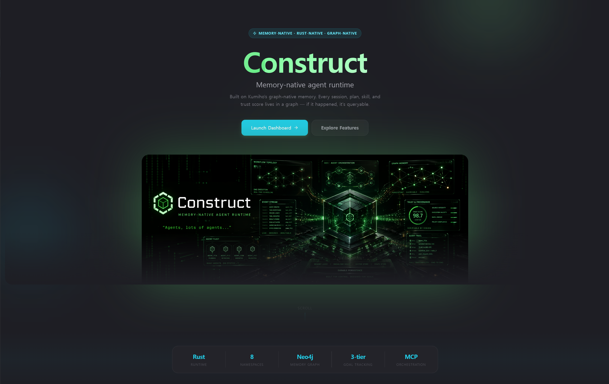

# Dashboard Development

Construct's dashboard is a React + TypeScript + Tailwind + Vite app in
[`web/`](../../web). The Rust gateway embeds the production build from
`web/dist/` into the binary at compile time via `rust-embed` and serves it at
`/_app/`, with a top-level redirect so the dashboard opens at
`http://127.0.0.1:42617/`.

The landing entry point lives at [`web/src/pages/Landing.tsx`](../../web/src/pages/Landing.tsx).
All operational pages (Dashboard, Workflows, Teams, Agents, Skills, Canvas,
Cron, Cost, Audit, Logs, Doctor, Memory, Assets, Integrations, Config, Tools,
Pairing, WorkflowRuns) live under [`web/src/construct/pages/`](../../web/src/construct/pages/),
with the shell/layout/navigation under
[`web/src/construct/components/layout/`](../../web/src/construct/components/layout/).
Routing is defined in [`web/src/App.tsx`](../../web/src/App.tsx).

## Local Build From Source

### Runtime prerequisites

- Rust stable toolchain
- Node.js with npm
- Python 3.10+ if you also want the Kumiho / Operator sidecars

### Build the CLI and embedded dashboard

```bash
git clone <construct-repo>
cd construct
cargo build --release --locked

cd web
npm ci
npm run build

cd ..
cargo build --release --locked
```

Why two builds:

- `npm run build` writes the dashboard bundle into `web/dist/`
- the subsequent Rust build re-embeds `web/dist/` into the Construct binary via `rust-embed`

## Run Locally

<!-- TODO screenshot: Construct dashboard landing page served by the gateway on localhost:42617 -->


### Gateway + dashboard

```bash
cargo run -- gateway start
```

Open:

- Dashboard: `http://127.0.0.1:42617`
- Embedded assets: `http://127.0.0.1:42617/_app/`

### Full runtime

```bash
cargo run -- daemon
```

That starts the gateway plus long-running runtime services.

### Containerized dev environment

```bash
./dev/cli.sh up
```

Useful when you want an isolated sandbox rather than running directly on the host. See [`dev/README.md`](../../dev/README.md) for the full workflow.

<!-- TODO screenshot: Vite dev server running the dashboard frontend in hot-reload mode at localhost:5173 -->


## Frontend Dev Workflow

Construct now supports a separate Vite dev server for dashboard iteration.

Terminal 1:

```bash
cargo run -- gateway start
```

Terminal 2:

```bash
cd web
npm ci
npm run dev
```

Open:

- Vite dev UI: `http://127.0.0.1:5173`

How it works:

- Vite serves the React app with hot reload
- `/api`, `/pair`, `/health`, `/admin`, and `/ws/*` are proxied to the Construct gateway at `http://127.0.0.1:42617`
- set `CONSTRUCT_GATEWAY_URL=http://host:port` before `npm run dev` if your gateway runs elsewhere

When you are done with UI work, rebuild the embedded bundle:

```bash
cd web
npm run build

cd ..
cargo build
```

## Desktop App Workflow

The Tauri desktop app does not build its own separate frontend bundle. It points at the Construct gateway:

- `apps/tauri/tauri.conf.json` uses `http://127.0.0.1:42617/_app/`

So the practical loop is:

1. Run the gateway
2. Build or hot-reload the dashboard
3. Launch the Tauri shell against that gateway

<!-- TODO screenshot: dashboard shell layout showing sidebar, header, and main content regions -->


## Dashboard Shell Ownership

If you are changing navigation, the main ownership points are:

- [`web/src/construct/components/layout/Layout.tsx`](../../web/src/construct/components/layout/Layout.tsx): shell frame, content offset, mobile drawer state
- [`web/src/construct/components/layout/Sidebar.tsx`](../../web/src/construct/components/layout/Sidebar.tsx): sidebar UI and nav rendering
- [`web/src/construct/components/layout/Header.tsx`](../../web/src/construct/components/layout/Header.tsx): top bar actions and current-surface context
- [`web/src/construct/components/layout/construct-navigation.ts`](../../web/src/construct/components/layout/construct-navigation.ts): canonical nav sections and route metadata
- [`web/src/construct/pages/Dashboard.tsx`](../../web/src/construct/pages/Dashboard.tsx): dashboard hero, top-level tab sections, and summary hierarchy
- [`web/src/index.css`](../../web/src/index.css): shell visuals, motion, and dashboard chrome

Route declarations live in [`web/src/App.tsx`](../../web/src/App.tsx). The
legacy `/memory-auditor` URL now redirects to `/memory`.
